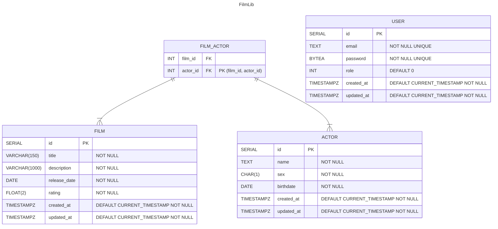

## ER 

```mermaid
---
title: FilmLib
---
erDiagram
    ACTOR {
        SERIAL id PK
        TEXT name "NOT NULL"
        CHAR(1) sex "NOT NULL"
        DATE birthdate "NOT NULL"
        TIMESTAMPZ created_at "DEFAULT CURRENT_TIMESTAMP NOT NULL"
        TIMESTAMPZ updated_at "DEFAULT CURRENT_TIMESTAMP NOT NULL"
    }

    FILM {
       SERIAL id PK
       VARCHAR(150) title "NOT NULL"
       VARCHAR(1000) description "NOT NULL"
       DATE release_date "NOT NULL"
       FLOAT(2) rating "NOT NULL"
       TIMESTAMPZ created_at "DEFAULT CURRENT_TIMESTAMP NOT NULL"
       TIMESTAMPZ updated_at "DEFAULT CURRENT_TIMESTAMP NOT NULL"
    }

    FILM_ACTOR ||--|{ FILM: ""
    FILM_ACTOR ||--|{ ACTOR: ""
    FILM_ACTOR {
        INT film_id FK
        INT actor_id FK
        "PK (film_id, actor_id)"
    }
    
     USER {
        SERIAL id PK
        TEXT email "NOT NULL UNIQUE"
        BYTEA password "NOT NULL UNIQUE"
        INT role "DEFAULT 0"
        TIMESTAMPZ created_at "DEFAULT CURRENT_TIMESTAMP NOT NULL"
        TIMESTAMPZ updated_at "DEFAULT CURRENT_TIMESTAMP NOT NULL"
    }
```
