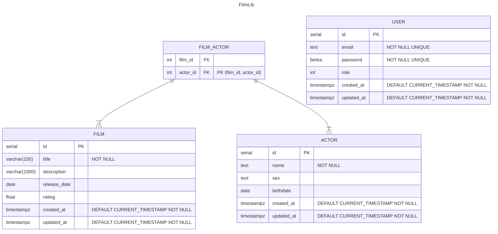

## ER 

```mermaid
---
title: FilmLib
---
erDiagram
    ACTOR {
        serial id PK
        text name "NOT NULL"
        text sex
        date birthdate
        timestampz created_at "DEFAULT CURRENT_TIMESTAMP NOT NULL"
        timestampz updated_at "DEFAULT CURRENT_TIMESTAMP NOT NULL"
    }

    FILM {
       serial id PK
       varchar(150) title "NOT NULL"
       varchar(1000) description
       date release_date
       float rating
       timestampz created_at "DEFAULT CURRENT_TIMESTAMP NOT NULL"
       timestampz updated_at "DEFAULT CURRENT_TIMESTAMP NOT NULL"
    }

    FILM_ACTOR ||--|{ FILM: ""
    FILM_ACTOR ||--|{ ACTOR: ""
    FILM_ACTOR {
        int film_id FK
        int actor_id FK
        "PK (film_id, actor_id)"
    }
    
     USER {
        serial id PK
        text email "NOT NULL UNIQUE"
        betea password "NOT NULL UNIQUE"
        int role
        timestampz created_at "DEFAULT CURRENT_TIMESTAMP NOT NULL"
        timestampz updated_at "DEFAULT CURRENT_TIMESTAMP NOT NULL"
    }
```
